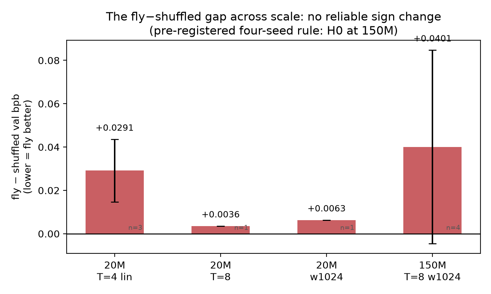
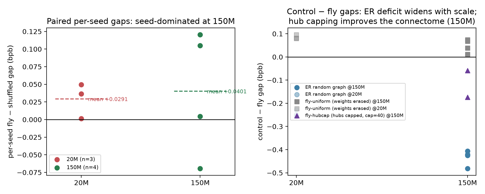
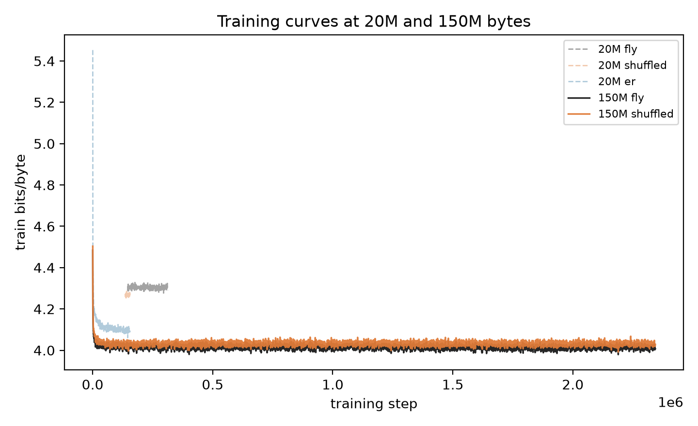

# Hub Concentration Masks the Benefit of Biological Connectome Structure in Small Language Models

**Michelangelo Romero Chisco**
Ternative — Bogotá, Colombia
michelangeloromerochisco@gmail.com

## Abstract

We test whether the exact wiring of a measured biological connectome is a useful prior for language modeling. Byte-level language models are trained whose entire recurrent substrate is the frozen larval *Drosophila* connectome (2,952 neurons, 38,401 edges); only adapter parameters are trained, and conditions differ solely in the frozen graph: the real connectome, a degree-preserving shuffle, an Erdos-Renyi random graph, a weight-erased variant, and a hub-capped variant that removes only the concentration of inputs onto hub neurons. Under pre-registered decision rules, three results emerge. First, at 150M training bytes the raw connectome is statistically indistinguishable from its degree-preserving shuffle (mean gap +0.040 bits/byte, paired t=0.90, ns); an interim two-seed reversal did not survive the pre-committed four-seed rule. Second, capping hub in-degrees at 40, which preserves edge count, synapse weights, and mean in-degree, improves the real connectome in both seeds tested (by 0.174 and 0.059 bits/byte) and outperforms the degree-matched shuffle (by 0.170 and 0.129). Third, an Erdos-Renyi graph with unconstrained degree concentration outperforms every biological variant at every scale, with an advantage that grows with training; synapse-weight statistics carry a stable benefit throughout. We conclude that hub concentration masks a benefit of biological wiring on this task, and that evaluations of connectome-derived priors must control for degree concentration and report seed-matched, scale-resolved comparisons. All code and results are released.

---

## 1 Introduction

Graph topology is a natural source of inductive bias in sparse neural systems. In machine learning, structured connectivity can influence optimization dynamics, representational bias, and computational cost even when parameter count is held fixed. In neuroscience, connectomes now provide concrete wiring diagrams at single-neuron resolution rather than abstract graph models, offering a direct way to test whether biologically derived topology contributes useful computational structure.

A growing body of work builds neural networks constrained by these diagrams. Connectome-constrained models reproduce measured neural activity in the fly visual system (Lappalainen et al., 2024) and support whole-brain simulations with learned sensorimotor processing (Shiu et al., 2024). Adjacent work asks whether biological wiring helps as an *architectural prior* for artificial tasks: connectome-informed priors improve data efficiency in small language models (Kotar & Tuckute, 2025), and connectome-inspired stochastic routing improves attention (Jin & Sui, 2026). The unstated stronger claim, that the *exact wiring* of a real brain is a useful prior for general-purpose computation, is rarely tested against null models sharp enough to isolate it.

This paper asks that question at the smallest scale where an entire brain can serve as the recurrent medium of a language model. The larval *Drosophila* connectome (Winding et al., 2023; 2,952 neurons, 38,401 strong connections) becomes the complete recurrent substrate of a byte-level language model. Only adapter parameters (input drive, per-neuron gains, readout; ~782k parameters) are trained; the graph and its synapse-count weights are frozen. Because the substrate is frozen, any performance difference between conditions is attributable to the graph alone.

Our contributions:

1. **A control ladder for connectome-ML claims.** We evaluate the real connectome against a degree-preserving shuffle (same in-degree sequence, random wiring), an Erdős–Rényi graph (same density, unconstrained degrees), a weight-erased variant (same wiring, uniform weights), and a hub-capped variant (the new control this paper introduces) (same wiring and weights, only the hub concentration removed). Each control isolates one ingredient: wiring beyond degree, degree distribution, weights, and hub concentration respectively.

2. **A negative result with an unusual audit trail.** The raw connectome's wiring is not better than degree-matched random wiring at any scale tested, but our confidence in this null came only after an interim two-seed sign *reversal* (fly ahead by 0.033 bits/byte) did not survive the pre-registered four-seed endpoint. We report the full pre-registration trail because it is a concrete demonstration of how seed variance manufactures topology effects in small-scale comparisons. The degree-matched shuffle itself varies across seeds by 0.18 bits/byte, over four times the headline gap it is used to estimate.

3. **A mechanism result: hub concentration masks a wiring benefit.** Capping hub in-degrees at 40 improves the real connectome in both seeds tested and outperforms the degree-matched shuffle in both. The biological wiring is not the liability; its hub concentration is. Meanwhile the unconstrained hubs of a random graph yield the best-performing configuration on this task, with an advantage that grows with training scale. Degree concentration, not biological specificity, dominates this task.

4. **A released, fully regenerable harness.** All experiments ran on a single consumer-grade laptop GPU (NVIDIA RTX 3050, 4 GB; ~277 GPU-hours total). Code, parsed connectome, per-cell training curves, pre-registrations, and reports are released for replication.

## 2 Related Work

**Connectome-constrained modeling.** Lappalainen et al. (2024) showed that networks constrained by the fly visual connectome predict neural responses across the visual system; Shiu et al. (2024) extended connectome-constrained simulation to a whole-brain computational model with learned sensorimotor processing. These works demonstrate that connectome-constrained networks can match neurobiological data. Our question is adjacent but different: we ask whether the wiring helps a *non-biological* task (language) and therefore compare against task-matched nulls rather than neural data.

**Null models in connectome-ML.** Dhiman (2026) showed that apparent topology advantages in connectome-constrained networks can arise from initialization and null-model confounds, and largely disappear under from-scratch initialization and degree-preserving rewiring. Therianos (2026) found that a frozen rate operator built from the complete larval connectome has gross dynamics largely fixed by its degree and weight statistics, with exact wiring governing input routing and specific modes. Both works inform our design: we adopt degree-preserving rewiring as the primary null and treat degree/weight statistics as the first-order explanation to be excluded, not assumed.

**Connectome priors for language.** Kotar & Tuckute (2025) trained language models that inherit a "model connectome" through an evolutionary outer loop and found better or on-par performance at developmental data scales. Their connectomes are evolved artifacts, not measured brains. Jin & Sui (2026) extracted a routing primitive, stochastic shortcuts, from adult fly wiring statistics and used it to improve attention. Our work measures the *measured* connectome itself, held frozen, against its own nulls.

**Spiking language models.** URCHIN (Chiang, 2026) trains a horizontal spiking language model for data-constrained pretraining; our substrate likewise uses leaky integrate-and-fire (LIF) dynamics with surrogate-gradient training (Neftci et al., 2019). We differ in freezing the recurrent substrate entirely, so that topology is the only moving part.

**Distillation.** Knowledge distillation (Hinton et al., 2015) is a standard rescue for weak inductive priors; we test and reject it as a topology rescue at our scale.

## 3 Problem Formulation

Let G be a directed, weighted graph on N neurons. A connectome-substrate language model is a system

  s_t = Spike(v_t),  v_{t+1} = f(v_t, W s_t, d_t),  y_t = g(s_t)

where W is the frozen weighted adjacency matrix of G, d_t is the input drive derived from the current byte, and g is a trainable readout. We compare four frozen graphs and one intervention:

- **fly**: the measured connectome (Winding et al., 2023), edges at ≥3 synapses, weights = synapse counts.
- **shuffled**: the fly's in-degree sequence preserved, targets rewired at random, weights permuted. Isolates *wiring beyond degree sequence*.
- **er**: Erdős–Rényi, same N and edge count, weights permuted. Isolates *degree distribution* (unconstrained concentration).
- **fly-uniform**: fly's exact wiring, all weights set to 1. Isolates *synapse-weight statistics*.
- **fly-hubcap**: fly's wiring and weights, but every neuron's in-degree capped at 40 (137 neurons exceed the cap; the fly's maximum in-degree is 99, ER's is ~26). Trimmed edges are re-attached to random recipients below the cap, preserving sources, weights, edge count, and mean in-degree (13.01). Isolates *hub concentration*.

The comparisons have a precise structure:

- fly vs shuffled tests wiring beyond the degree sequence;
- fly vs fly-uniform tests weight statistics beyond wiring;
- fly vs er tests the fly's degree distribution against unconstrained concentration;
- fly-hubcap vs fly tests hub concentration with everything else approximately held fixed;
- fly-hubcap vs shuffled additionally differs in degree distribution (the shuffle retains the fly's hub-containing degree sequence), so it is a *conjunction* test: it shows the capped connectome outperforming its null, not wiring purity.

**Interpretation rules.** All conclusions in this paper follow pre-committed decision rules (Section 4.5), written before the data that decides them existed. We regard this as essential in a regime where a single seed can flip a comparison's sign.

## 4 Methods

### 4.1 Connectome substrate

We use the larval *Drosophila* brain connectome (Winding et al., 2023), Supplementary Data S1: 2,952 neurons, 352,611 total synapses. Edges with at least 3 synapses are kept (the dataset's "strong connection" convention), giving 38,401 edges with weights equal to synapse counts (range 3–121). The graph has 430 annotated sensory neurons (input sites) and 46 output neurons (readout sites). Basic statistics: mean in-degree 13.01, maximum in-degree 99, weighted spectral radius 289 (a heavily hub-concentrated graph); the same-density Erdős–Rényi graph has maximum in-degree ~26 and weighted spectral radius ~88.

### 4.2 Model and training

Each byte is encoded as a drive on the 430 sensory neurons (learned linear map, 256×430), then propagated through T ticks of LIF dynamics (V_rest=−52 mV, V_thresh=−45 mV, τ=20 ms, dt=1 ms, unit EPSP 0.275 mV, recurrent current scaled by 0.10), with membrane state carried across bytes. Spikes are differentiated through a fast-sigmoid surrogate gradient within the byte window (Neftci et al., 2019). The readout is a linear map from output-neuron spike statistics to 256 byte logits (a 2-layer MLP of width 1024 in the capacity arms). Trainable parameters total ~782k in the base configuration, identical across all conditions; the recurrent substrate is frozen everywhere.

Training: AdamW, learning rate 3e-3, gradient clip 1.0, batch 64, on TinyStories (Eldan & Li, 2023). Scale arms: 20M and 150M training bytes; capacity arms: T=4→8 ticks and a 1024-wide two-layer MLP readout (linear in the base configuration). Validation is 150k bytes of hard cross-entropy in bits/byte, drawn from a held-out region beyond the training window (the region differs between the 20M and 150M phases; within-phase comparisons are unaffected, and all headline comparisons are within-phase).

### 4.3 Knowledge distillation arm

A byte-level transformer teacher (3.36M parameters, context 512, validation 1.344 bits/byte, a factor of ~3 below any student) provides soft targets over the 20M-byte window. Students train on a mixture (1−α)·CE(true) + α·τ²·CE(teacher), with α=0.25, τ=1 (a first pass with α=0.5, τ=2 was excluded from analysis due to a data-reader alignment bug). The pre-registered rescue criterion: distillation "rescues" the fly topology only if the fly−shuffled gap under distillation is ≤ 0.

### 4.4 The hubcap intervention

The fly graph's in-degree distribution has a long tail: 137 of 2,952 neurons receive more than 40 inputs, up to a maximum of 99. ER at the same density never exceeds ~26. We construct fly-hubcap by capping every postsynaptic in-degree at 40: edges into above-cap neurons are re-attached, at random, to strictly-below-cap recipients drawn uniformly. Presynaptic sources, edge count, per-edge weights, and mean in-degree are preserved; only the concentration of inputs onto hub neurons changes. The same frozen LIF dynamics and identical adapters are used.

### 4.5 Pre-registration and decision rules

The study ran in three phases, each pre-registered before its data existed:

- **Phase 1** (20M bytes, multi-seed + two capacity arms + the distillation arm): the pre-committed question was whether any lever flips the fly−shuffled sign. The rejection criterion, that fly fails to outperform shuffled at matched budget, was evaluated on the multi-seed cells.
- **Phase 2** (150M bytes, T=8, width 1024; both capacity levers plus 7.5× data, seeds 0–1): the pre-registered primary endpoint was the change in the fly−shuffled gap versus Phase 1. Decision rule: gap ≤ 0 at 150M *and* the change ≤ 0 ⇒ "scale rescues biological wiring" (H1); |change| ≤ 0.01 ⇒ null; change > +0.01 ⇒ null strengthened.
- **Phase 3** (seeds 2–3 of the 150M quartet, plus the hubcap arm): the pre-registered primary endpoint pooled all four seeds and required ≥3 of 4 per-seed gaps negative (or a negative mean with 3/4 sign agreement) to sustain a rescue claim; otherwise the gap null (H0) is reinstated. The hubcap arm carried three pre-registered mechanism hypotheses: capping hurts (hubs beneficial), capping helps (hub drag; predicts hubcap ≈ shuffled), or |difference| < 0.01 (hubs irrelevant).

The rule that decided this paper, the four-seed sign test, was written on 20/09/2026, before any Phase 3 data existed. The two-seed H1 result of Phase 2, the seed-2 reversal, and the final verdict are all reported below exactly as they unfolded.

## 5 Results

### 5.1 At small scale, the raw connectome provides no benefit

At 20M bytes, over 3–4 seeds per condition:

| condition | n | mean bits/byte | sd |
|---|---|---|---|
| er | 3 | **4.0288** | 0.0067 |
| shuffled | 3 | 4.2442 | 0.0291 |
| fly | 4 | 4.2728 | 0.0081 |
| fly-uniform | 3 | 4.3590 | 0.0016 |

The fly underperforms its degree-preserving shuffle by +0.029 bits/byte (t=2.02, ns at this n), underperforms the random graph by +0.245 (t=27), and loses a further +0.086 when its synapse weights are erased. The fly's wiring, beyond its degree sequence, provides no benefit here, and its hub-containing degree distribution is worse than unconstrained concentration. Only the weight statistics contribute positively.

### 5.2 Capacity and distillation shrink the gap; neither reverses it

Two capacity levers and a distillation lever were applied at 20M bytes (seed 0):

| lever | fly | shuffled | fly−shuffled gap |
|---|---|---|---|
| base (T=4, linear) | 4.2621 | 4.2256 | +0.0365 |
| T=8 | 4.0579 | 4.0543 | +0.0036 |
| width 1024 | 4.1841 | 4.1777 | +0.0063 |
| distillation (α=0.25) | 4.2564 | 4.2263 | +0.0301 |

Every lever moves the gap in the fly's favor (distillation: −0.0063; T=8: −0.033; width: −0.030), and the fly gains more per lever than the shuffle does, but no lever crosses zero, and the distillation rescue criterion (gap ≤ 0) is not met. Distillation helps the weakest substrates most (ER −0.0138, fly −0.0057, shuffled +0.0007): it acts as a capacity equalizer, not a topology equalizer.

### 5.3 Scale does not rescue the raw connectome: a sign reversal that did not survive replication

Phase 2 ran the maximum-scale configuration on this hardware: 150M bytes, T=8, width 1024. The first two seeds produced a sign reversal (fly 3.9546 vs shuffled 3.9871, a gap of −0.033 against +0.029 at 20M, a change of −0.061), triggering the pre-registered H1 ("scale rescues biological wiring") at n=2. The remaining two seeds, pre-registered as the decisive endpoint, reversed it:

| seed | fly | shuffled | gap (fly−shuffled) |
|---|---|---|---|
| 0 | 3.9741 | 3.9696 | +0.0045 |
| 1 | 3.9350 | 4.0046 | −0.0696 |
| 2 | 3.9911 | 3.8707 | +0.1204 |
| 3 | 3.9284 | 3.8234 | +0.1049 |
| **mean** | 3.9572 (sd 0.0303) | 3.9171 (sd 0.0843) | **+0.0401** |

Per the pre-committed rule (≥3 of 4 negative required to sustain the rescue), **H0 is reinstated: at 150M bytes the raw connectome is statistically indistinguishable from its degree-matched shuffle** (mean gap +0.040, sd 0.089, paired t=0.90, df=3, ns). The two-seed reversal was attributable to seed-level sampling variance. Figure 1 traces the gap across the full scale ladder; Figure 2 (left) shows the per-seed gaps.

The seed structure deserves emphasis, because it is a methodological finding of this study in its own right: the *shuffle*, not the fly, carries almost all the variance (sd 0.084 vs 0.030; its seed range spans 3.823–4.005, a 0.18 bits/byte range). Any fly-vs-shuffle comparison at one or two seeds in this regime is dominated by the particular rewiring realized under a given seed. We suspect this applies beyond our setup: degree-preserving rewirings vary in how far they depart from the original graph's higher-order structure, and this seed-level variation suffices to produce or eliminate "topology effects" of the magnitude at issue here.

*Figure 1. The fly−shuffled validation gap (bits/byte) across the scale ladder. Error bars are standard errors of the paired per-seed gaps; n per configuration is shown at the zero line. The pre-registered four-seed rule reinstates the null at 150M.*

*Figure 2. Left: per-seed fly−shuffled gaps at 20M and 150M bytes; dashed lines are means. Right: control−fly gaps for the ER, weight-erased, and hub-capped conditions at both scales.*

### 5.4 Hub concentration masks a genuine wiring benefit

The hubcap arm tests the mechanism directly: it retains the real connectome's wiring pattern, weights, edge count, and mean in-degree, removing only the concentration of inputs onto its strongest hubs (Figure 2, right).

| seed | fly-hubcap | fly | hubcap−fly | shuffled | hubcap−shuffled |
|---|---|---|---|---|---|
| 0 | **3.8001** | 3.9741 | −0.1741 | 3.9696 | −0.1696 |
| 1 | **3.8761** | 3.9350 | −0.0589 | 4.0046 | −0.1285 |

Two facts, both consistent across seeds. First, capping hubs improves the real connectome (mean −0.1165), supporting the pre-registered hub-drag hypothesis. The pre-registered prediction was that hubcap would perform comparably to shuffled; the outcome exceeded it: the capped connectome outperforms the uncapped shuffle in both seeds (mean −0.1490). Second, the improvement moves the connectome most of the way toward the best configuration: the full ordering at 150M is

**ER (3.5234) < fly-hubcap (3.8381) < shuffled (3.9171) < fly (3.9572) < fly-uniform (4.0049)**

We interpret this as follows: the fly's exact wiring contains a genuine computational asset (revealed when its hubs stop bottlenecking it), and the fly's hub distribution is the specific ingredient that suppresses that asset. But the claim has a precise boundary, and we state it deliberately:

- hubcap vs fly isolates hub concentration (everything else approximately fixed); this is the clean causal statement;
- hubcap vs shuffled differs in degree distribution *and* wiring (the shuffle retains the fly's uncapped degree sequence), so it demonstrates the capped connectome outperforming its null, not wiring purity;
- fly-hubcap does **not** outperform ER. The unconstrained hubs of the random graph remain the best-performing substrate on this task. We claim an *unmasked benefit over degree-matched random wiring*, never superiority over all random graphs.

The missing cell, a hub-capped *shuffle* (same capped degree sequence, random wiring), would separate residual-wiring benefit from residual-degree effects; it is the natural next experiment.

### 5.5 What is robust across all scales and seeds

Two effects survived every phase, arm, and seed:

**The ER advantage grows with training scale.** fly−er widens monotonically: +0.245 (20M, T=4) → +0.320 (20M, T=8) → **+0.434 (150M, pooled n=4)**. ER is also notably seed-stable (sd 0.029; range 3.507–3.568) while the shuffle varies substantially across seeds: the unconstrained random graph is both the best-performing substrate and the most predictable one. Whatever the fly's degree distribution lacks relative to unconstrained concentration, scale amplifies the deficit.

**Real synapse weights outperform uniform weights at every scale.** Erasing the fly's weight statistics (fly-uniform) costs +0.086 bits/byte at 20M and +0.048 at 150M (n=4, seed range 4.002–4.012, the most seed-stable condition of all). The signal in a connectome substrate lies first in its weight statistics; the wiring is the contested ingredient; the hub concentration is the liability. Training curves for representative runs at both scales are shown in Figure 3.

*Figure 3. Training curves (train bits/byte vs. step) for representative 20M and 150M runs.*

## 6 Mechanism Analysis

Why does hub concentration hurt a frozen substrate on this task? Three compatible explanations, in descending order of support:

1. **Recurrent-gain pathology.** The fly's weighted spectral radius is 289, versus ~88 for the same-density ER graph. In the measured connectome, the strongest synapses fall on the most-connected neurons, so the fly's hubs are simultaneously gain amplifiers: activity that enters a hub's fan-in is re-amplified down its fan-out, working against the per-neuron gain adaptation that is the only mechanism available to the adapters for controlling dynamics. Capping in-degrees reduces the graph's effective gain without altering the weights. This is consistent with the observation that fly-uniform, which removes the weight-hub correlation, is the condition in which the fly's raw topology is least disadvantaged.

2. **Bottleneck routing.** A byte-level language model needs broad, short-path mixing from input sites to readout sites: the ER graph reaches all 46 output neurons in ~1.1 mean hops from sensory drive, the shuffle in ~2.0, the fly in 3.4 (and only 30 of 46 outputs reachable within the window). The fly's hubs concentrate precisely the mixing that this task benefits from having distributed.

3. **What the hubcap result adds.** Removing hub concentration while keeping the biological wiring pattern recovers a substantial fraction of the ER gap (the fly−ER deficit shrinks from +0.434 to +0.315). This localizes the fly's deficit to hub concentration rather than to its wiring motifs: the motifs are, once hubs are capped, an asset relative to random wiring with hub-containing degree sequences.

## 7 Discussion

**For connectome-ML methodology.** Our results extend the null-model discipline of Dhiman (2026) and the statistics-first reading of Therianos (2026) from sensory networks to language modeling, and add a new rung to the control ladder: the hub cap. The general pattern is the same in all three studies: apparent advantages of measured biological wiring attenuate or invert as the controls sharpen (degree sequence here, initialization there, degree-and-weight statistics in the frozen-operator setting). The ingredient that survives our sharpening is not wiring but *weight statistics*, plus a wiring benefit visible only after hub removal. Evaluations that compare a connectome against a naive random graph alone, a practice Dhiman (2026) documents and critiques, measure degree concentration and weight statistics at least as much as they measure biological wiring.

**For the scale question.** The expectation that motivated our scale hypothesis, that a fixed structural prior becomes more beneficial as training scale grows, does not hold for raw connectome wiring at the scales we could reach: the fly−shuffled gap is statistically flat across 20M→150M, while the fly−ER deficit grows. If biological wiring encodes a language-relevant inductive bias in this regime, it is below our seed-matched detection floor. We note that our earlier two-seed reading ("scale rescues biological wiring") is exactly the kind of claim that pre-registration exists to catch; we report the reversal in full.

**For neuromorphic and resource-constrained settings.** The entire study ran on a single consumer-grade laptop GPU (~277 GPU-hours). The practical implication is direct: if a complete, measured, synapse-weighted connectome substrate adds no reliable benefit over degree-matched random wiring for language, and its hubs actively hurt, then compute spent emulating brain *structure* is better spent on data and adapters, unless the hub distribution is engineered first. The most effective substrate we identified was also the least biological: a random graph with unconstrained hubs.

**What would change our mind.** (a) A hub-capped shuffle landing between hubcap and ER would attribute the residual gap to wiring motifs; landing at ER would attribute it to the capped degree distribution. (b) Substrate-scale connectomes with task-aligned I/O populations (the larval graph's 430→46 sensory→output funnel is a reflex pipeline, not a text interface). (c) Trainable recurrent weights, which we freeze by design to isolate topology. (d) Sensorimotor-structured tasks, where the connectome's priors should be aligned rather than mismatched. (e) A ≥1B-byte replication of the hubcap effect, which our hardware cannot reach; the effect's size (−0.1165 mean, both seeds) makes it the claim most worth replicating.

## 8 Limitations

1. **Scale ceiling.** 150M bytes and ~782k adapter parameters on a 4 GB laptop GPU is far below the scale of contemporary language models; a cloud-scale replication (≥1B bytes) is untested. The hubcap result is n=2.
2. **Hubcap's degree confound.** fly-hubcap vs shuffled differs in degree distribution as well as wiring; the hub-capped-shuffle cell required to fully separate them has not been run.
3. **I/O mismatch by design.** Byte drive enters through 430 sensory neurons and exits through 46 output neurons of a reflex circuit; this is a deliberately hard transfer test, and the adapters may be too small to compensate.
4. **Frozen weights.** Synapse counts are a coarse proxy for effective weights; allowing the substrate to fine-tune could change the ranking (at the cost of no longer answering the topology question).
5. **Validation regions differ across scales** ([20M, 20.15M) vs [150M, 150.15M)); all headline comparisons are within-phase, but cross-phase gap changes inherit this caveat.
6. **Single dataset.** TinyStories consists of simple, machine-generated English; topology effects could be dataset-dependent.
7. **Statistical power.** n=4 seeds (n=2 for hubcap) is the maximum this hardware could deliver; effects smaller than ~0.09 bits/byte are below the paired detection floor.

## 9 Conclusion

A complete, measured, synapse-weighted brain connectome, used as the frozen recurrent substrate of a language model, is not better than degree-matched random wiring at any scale we could test, and the reason is specific: its hub concentration. Removing the hubs (while keeping the biological wiring, the weights, the edges, and the mean degree) improves the connectome in every seed tested and lifts it above its degree-matched null, while the random graph whose hubs are unconstrained remains the best substrate of all. The stable assets of a connectome substrate are its synapse-weight statistics; the liability is its input concentration; the contested ingredient, exact wiring, becomes an asset only after the liability is engineered away. For the growing practice of using measured brains as architectural priors, the practical prescription is a control ladder: degree-preserving nulls, weight-matched nulls, hub-matched nulls, seed-matched replication, and pre-registered decision rules, because at this scale a single seed can reverse a comparison, and only pre-committed rules can adjudicate it. We release the full harness, the parsed connectome, and every number behind this paper.

## Reproducibility Statement

All code (model, controls, runners, watchdogs, report generators), the parsed connectome, per-cell JSON results with full training curves, pre-registration documents, and phase reports are released at github.com/michelangeloromerochisco (fly-distill). Every number in this paper is regenerable by the released runners on a single consumer GPU (NVIDIA RTX 3050 Laptop, 4 GB); total compute across all phases is ~277 GPU-hours.

## References

- Chiang, P.-H. (2026). URCHIN: A Horizontal Spiking Language Model for Data-Constrained Pretraining. arXiv:2609.13899.
- Dhiman, N. (2026). Topological Sensitivity in Connectome-Constrained Neural Networks. arXiv:2604.04033.
- Eldan, R., & Li, Y. (2023). TinyStories: How Small Can Language Models Be and Still Speak Coherent English? arXiv:2305.07759.
- Hinton, G., Vinyals, O., & Dean, J. (2015). Distilling the Knowledge in a Neural Network. arXiv:1503.02531.
- Jin, Z., & Sui, Y. (2026). Stochastic Attention: Connectome-Inspired Randomized Routing for Expressive Linear-Time Attention. arXiv:2604.00754.
- Kotar, K., & Tuckute, G. (2025). Model Connectomes: A Generational Approach to Data-Efficient Language Models. arXiv:2504.21047.
- Lappalainen, J. K., Tschopp, F. D., Prakhya, S., McGill, M., Nern, A., Shinomiya, K., et al. (2024). Connectome-constrained networks predict neural activity across the fly visual system. Nature, 634, 1132–1139. doi:10.1038/s41586-024-07939-3.
- Neftci, E. O., Mostafa, H., & Zenke, F. (2019). Surrogate Gradient Learning in Spiking Neural Networks. arXiv:1901.09948.
- Shiu, P. K., Sterne, G. R., Spiller, N., Franconville, R., Sandoval, A., Zhou, J., et al. (2024). A Drosophila computational brain model reveals sensorimotor processing. Nature. doi:10.1038/s41586-024-07763-9.
- Therianos, S. (2026). A frozen rate operator from the complete larval connectome: degree and weight govern the gross response, exact wiring governs input routing and mushroom-body modes. arXiv:2606.17745.
- Winding, M., Pedigo, B. D., Barnes, C. L., Patsolic, H. G., Park, Y., Kazimiers, T., et al. (2023). The connectome of an insect brain. Science, 379(6636). doi:10.1126/science.add9330.

## Appendix A: Pre-registration trail

- **Phase 2 pre-registration** (written 15/09/2026, before any Phase 2 data): primary endpoint Δ_gap = (fly−shuffled)|150M − (fly−shuffled)|20M; H1 required gap ≤ 0 at 150M with Δ_gap ≤ 0; n=2 fired H1 (gap −0.033, Δ −0.061).
- **Phase 3 pre-registration** (written 20/09/2026, before any Phase 3 data): ≥3 of 4 per-seed gaps negative (or negative mean with 3/4 sign agreement) required to sustain the rescue; hubcap hypotheses H-mech1/H-mech2/H-mech3 with the ≥0.01 threshold. The four-seed rule reinstated H0; H-mech2 fired.
- All pre-registrations, decision rules, and interim reports are preserved verbatim in RESEARCH.md in the released repository, including the interim seed-2 reversal note and the corrected statistics.

## Appendix B: Hardware and ops

All runs used an RTX 3050 Laptop GPU (4 GB) on Windows, with checkpoint/resume every 5,000 steps, idempotent self-relaunching runners, and persistent deadline guards (surviving multiple machine reboots and one RAM-exhaustion crash chain in Phase 1). Phase 3 completed 10/10 jobs with zero failures (~13 h/job). Total training time across all 47 runs is ~277 GPU-hours.